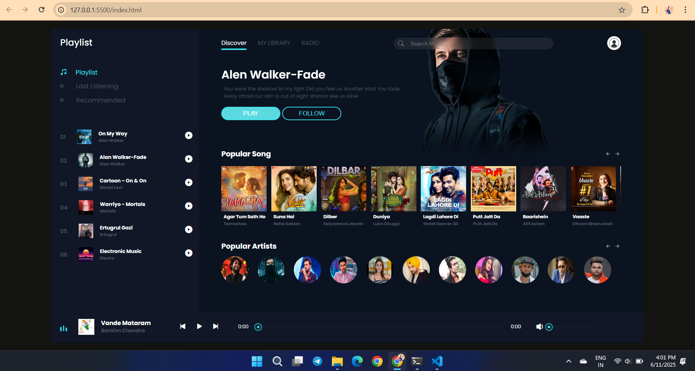
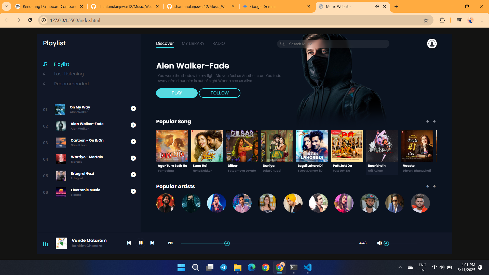

# Music_Website_using_HTML_CSS_-_JavaScript
A dynamic music player website built using HTML5, CSS3, and JavaScript. This project allows users to play, pause, skip, and go to the previous or next song with an interactive user interface and audio functionality.

## 🚀 Features

- Fully functional music player
- Play, pause, next, and previous controls
- Song list with album cover thumbnails
- Dynamic UI updates based on the selected track
- Audio control with HTML5 `<audio>` tag and JavaScript

## 📁 Project Structure

- `index.html` – Main HTML file with music player layout
- `style.css` – Styling for the layout and animations
- `app.js` – JavaScript for music player logic
- `audio/` – Folder containing all audio (MP3) files
- `img/` – Album cover images and artist thumbnails

## 🛠️ Tools Used

- HTML5
- CSS3 (Flexbox, Grid)
- JavaScript (DOM manipulation)
- Visual Studio Code

## 📽️ Demo Video

[🎬 Click here to watch the demo video](./img/demoRec.mp4)

## 📸 Screenshots

### 🎵 Music Player UI

### 🎼 Song Controls & List

